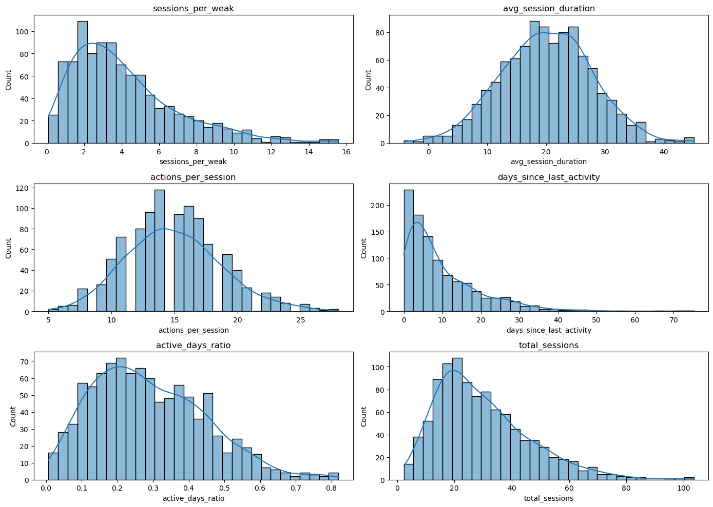
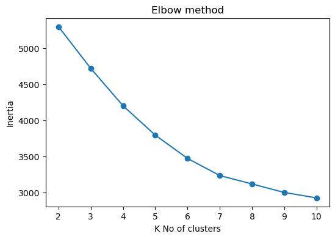
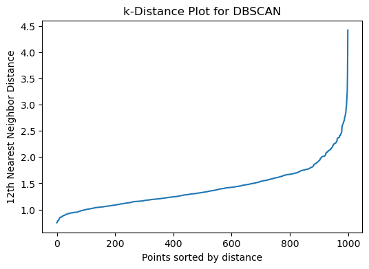
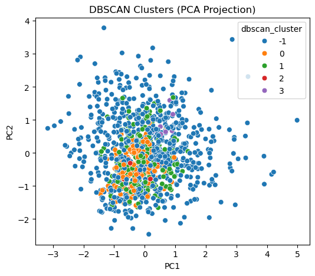

# MLDiaries 05 — User Activity Clustering (K-Means × DBSCAN)

This project is part of **MLDiaries**, a learning-in-public series focused on building *real machine learning intuition* instead of chasing perfect metrics.

In **MLDiaries 05**, the goal is to explore **unsupervised learning** through user activity data and understand how **different clustering algorithms see the same behavior differently**.

Rather than asking *“How accurate is the model?”*, this project asks:

> **“Does this structure actually make sense?”**

---

## 🎯 Project Objectives

- Design meaningful **behavioral features** for user activity
- Perform exploratory data analysis (EDA) before clustering
- Apply **K-Means** to force behavioral segmentation
- Apply **DBSCAN** to detect dense groups and reject noise
- Compare both algorithms through **fusion analysis**
- Learn when clustering *creates insight* — and when it *creates illusion*

---

## 📊 Dataset Overview (Synthetic User Activity)

A synthetic dataset of **1,000 users** was generated to simulate realistic user behavior.

### Behavioral Features

| Feature | Description |
|------|-------------|
| `sessions_per_week` | Engagement frequency |
| `avg_session_duration` | Depth of engagement |
| `actions_per_session` | Interaction intensity |
| `days_since_last_activity` | Churn signal |
| `active_days_ratio` | Usage consistency |
| `total_sessions` | Lifetime engagement |

📌 No labels were used.  
📌 No target variable exists.  
📌 This is **pure unsupervised learning**.

---

## 🔍 Exploratory Data Analysis (EDA)

Before clustering, feature distributions were carefully inspected to understand:
- skewness
- outliers
- behavioral spread

### Feature Distributions

**Key observations:**
- Heavy right skew in engagement features
- Long-tail behavior for churn-related variables
- High behavioral variance — ideal for clustering experiments

---

## ⚖️ Scaling (Non-Negotiable Step)

Since clustering relies on distance, all features were scaled using **StandardScaler**.

This ensured:
- no feature dominated distance calculations
- fair contribution from each behavioral dimension

---

## 📌 K-Means Clustering

### Elbow Method

The elbow method was used to select an appropriate number of clusters.

Silhouette scores across different `K` values:
{2: 0.1265,
3: 0.1379,
4: 0.1541,
5: 0.1514,
6: 0.1497,
7: 0.1501,
8: 0.1376,
9: 0.1385,
10: 0.1351}

📌 **K = 4** was chosen as a balance between interpretability and structure.

---

### K-Means Cluster Profiles (Standardized Means)

| Cluster | Key Behavioral Traits |
|------|------------------------|
| 0 | Low engagement, high inactivity |
| 1 | Stable long-term users |
| 2 | Casual, inconsistent users |
| 3 | High-frequency active users |

This step **forces every user into a cluster**, whether or not they truly belong.

---

## 🌐 DBSCAN Clustering (Density-Based)

DBSCAN was applied to:
- identify dense behavioral groups
- explicitly label **noise users**

### k-Distance Plot (eps Selection)

This guided the choice of `eps` and `min_samples`.

---

### DBSCAN Results

| DBSCAN Cluster | User Count |
|---------------|-----------|
| Noise (-1) | 677 |
| Cluster 0 | 126 |
| Cluster 1 | 168 |
| Cluster 2 | 20 |
| Cluster 3 | 9 |

📌 **Most users were classified as noise**, indicating weak global density.

---

### DBSCAN Visualization (PCA Projection)

DBSCAN reveals that **only a small subset of users form dense behavioral groups**.

---

## 🔁 Fusion Analysis: K-Means × DBSCAN

To understand disagreement between algorithms, a normalized crosstab was analyzed.

### Key Finding

| K-Means Cluster | DBSCAN Verdict |
|----------------|---------------|
| Cluster 0 | Mostly noise (artificial) |
| Cluster 1 | Weak structure |
| Cluster 2 | Strongest real signal |
| Cluster 3 | Mostly noise (artificial) |

📌 **K-Means creates structure.**  
📌 **DBSCAN questions it.**

---

## 🧠 Core Insights

- K-Means always finds clusters — even when none truly exist
- DBSCAN is conservative and prioritizes **honesty over coverage**
- Most user behavior is **messy, inconsistent, and non-clusterable**
- Noise users are not useless — they are often the most important

> **Good clustering is not about clean plots.  
It’s about believable structure.**

---

