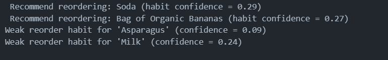

# MLDiaries 06 — Market Basket Sequencing for Habit Discovery 🛒

> *Not just who buys what — but what they reliably buy again.*

This project explores **sequential pattern mining** with a realistic lens.  
Instead of forcing “next-item journeys”, it focuses on **habit discovery** — identifying products that users consistently reorder over time.

The project uses the **Instacart Market Basket dataset**, where habitual behavior is strong and repeat purchases are meaningful.

---

## 🔍 Problem Motivation

Most market basket analyses stop at **co-occurrence** (Apriori-style rules).

But real customer behavior often looks like:
- repeated purchases
- stable consumption habits
- weak multi-step progression

This project asks a more honest question:

> **Which items do users repeatedly reorder across time?**

---

## 📊 Dataset

**Instacart Market Basket Dataset**
- `orders.csv`
- `order_products__prior.csv`
- `products.csv`

Key advantages of this dataset:
- Explicit order sequence (`order_number`)
- Real user behavior
- Strong habitual purchasing patterns

---

## 🧠 Core Ideas Explored

- Sequential pattern mining using **PrefixSpan**
- Difference between:
  - *progression-based sequences* (rare in groceries)
  - *habit-based sequences* (dominant signal)
- Why most multi-step journeys collapse under honest constraints
- How **reordering behavior** is more valuable than novelty in grocery data

---

## ⚙️ Methodology

### 1️⃣ Session & Sequence Design
- **One order = one sequence step**
- Orders are sorted using `order_number`
- Items within an order are treated as unordered

---

### 2️⃣ Conservative Sequential Mining
- PrefixSpan with:
  - high minimum support
  - short maximum sequence length
- Avoided lowering thresholds to force patterns

Result:
- Multi-step item progression was weak
- Repeated self-item sequences dominated (e.g., Banana → Banana)

---

### 3️⃣ Reframing: Habit Discovery
Instead of discarding results, the project reframes:

> **Self-repeating sequences represent habitual reordering behavior**

Examples:
- Soda → Soda
- Bag of Organic Bananas → Bag of Organic Bananas

These are not trivial — they are **core grocery signals**.

---

## 📈 Habit Confidence

For each item, a **habit confidence score** is computed:

